# 《通信软件开发与应用》课程结业报告
## 一、项目简介
 本项目采用纯 CSS 构建了一个静态网页，网页主题选择《镖人》漫画，本网页主要实现对漫画《镖人》的介绍功能，包括首页展示、作品简介、章节介绍、人物介绍、作品评论等五个功能。整体实现了六个页面。

## 二、开发过程
### 1. 首页设计
由于本网页主要是介绍《镖人》这部漫画，功能简介明了即可。
网页主页头部由导航栏和背景图组成。背景图明确网站主题。导航栏可以快速锁定所需要的内容。背景图使用主题相关图片，并在页面中央显示主页文字内容。导航栏分成两个部分，左部分为网页主题名；右部分为导航选项，用\<dv>标签包裹了六个元素，每个元素为一个带名字的超链接，来实现页面的转跳。
```html
<section class="header">
    <nav>
      <h2>BLADES OF THE GUARDIANS<span>鏢人</span></h2>
      <div id="navLinks">
        <i class="fa-solid fa-xmark" onclick="hideMenu()"></i>
        <a href="#">首頁</a>
        <a href="#introduction">簡介</a>
        <a href="#comic">漫畫</a>
        <a href="#characters">角色</a>        
        <a href="#evaluation">留言</a>
        <a href="#contact">交流</a>
      </div>
      <i class="fa-solid fa-bars" onclick="showMenu()"></i>
    </nav>
    <div class="text-box">
      
      <h1>中原廟堂&nbsp;<span class="pulser">&</span>&nbsp;西域江湖</h1>
      <p>天下熙熙皆爲利來，天下攘攘皆爲利往。<br>
        —— 司馬遷《史記》</p>
      <a href="#introduction" class="hero-btn">LEARN MORE</a>
    </div>
  </section>
```


### 2.主页设计
#### 2.1 简介页面
该页面主要介绍了漫画《镖人》的基本情况，分三个板块：作者、简介、影响。三个模块横向均匀分布。
```html
<section id="introduction">
    <h1>INTRODUCTION</h1>
    <p style="color: #777;">“我的朋友說，奴隸可以用錢贖回來，但人命，用多少錢都救不回來。你欠下的命債，就算是追到天涯海角，也得討回來。”<br>——特別附錄 大漠最平常的一天</p>
    <div class="row">
      <div class="col">
        <h3>Author</h3>
        <p> 許先哲，中国漫画家，主要作品有《镖人》等。<br>
          许先哲从小深受港片、意大利西部片、日本剑戟片等影视影响，又对刺客列传中的侠客精神深深着迷。以历史根基为内核，融合这些趣味做出一个大杂烩式电影一般的武侠故事，成为《镖人》的创作初衷。<br>
          在许先哲看来，自己并不是在创造，而是发现并展示给读者那些真实存在于另一个世界里的人物，周刊连载再辛苦，他也对内容无法妥协。 
          <br>“比起点击量，那些活生生的读者们用文字传达的温度，才是创作者前行的力量。”<br>许先哲说</p>
      </div>
      <div class="col">
        <h3>Story Content</h3>
        <p> 大業三年（西元607年），隋王朝在隋煬帝楊廣的殘暴統治下民不聊生。 <br>身手不凡的鏢客刀馬行走於西域大漠，在躲避朝廷追殺的途中，他接下了一個目的地為首都長安的護送任務，本以為只是一趟簡單的護鏢，卻沒想到一路危機四伏，險象環生。
        <br>一場牽動天下命運的旅途就此拉開帷幕……</p>
      </div>
      <div class="col">
        <h3>Influence</h3>
        <p> 凭借严谨的态度与过硬的质量，《镖人》以国漫崛起之姿强势输出到海外，不仅登陆日本知名电子阅读平台めちゃコミック连载，获得漫画大师高桥留美子（代表作《犬夜叉》）、藤泽亨（代表作《麻辣教师GTO》）的推荐，还3次登上日本央视NHK电视台新闻报道节目，被日媒誉为“世界级水平的中国动漫精品”</p>
      </div>
     
    </div>
  </section>
  ```
  .png)

#### 2.2 漫画界面
该页面介绍了漫画的章回，主要以大图的形式进行章节卷图的展示，同时，在每个展示图上加上鼠标停留效果。
```html
<section id="comic">
    <h1>COMIC CHAPTERS</h1>
    <p>“救人於難，那是菩薩的事。咱們是俗人，可不能平白無故就替人出頭。先把條件講好，大家彼此都心安理得。這才叫好買賣。”
      <br>—— 第十回 竖与燕子娘
    </p>
    <div class="row">
      <div class="col">
        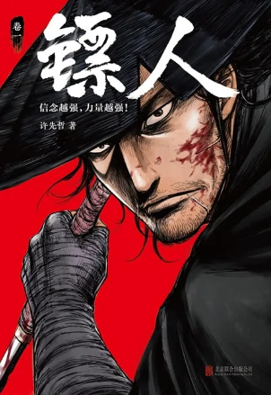
        <div class="layer">
          <h3>章回壹 游俠</h3>
        </div>
      </div>
      <div class="col">
        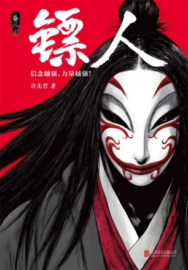
        <div class="layer">
          <h3>章回貳 大漠</h3>
        </div>
      </div>
      <div class="col">
        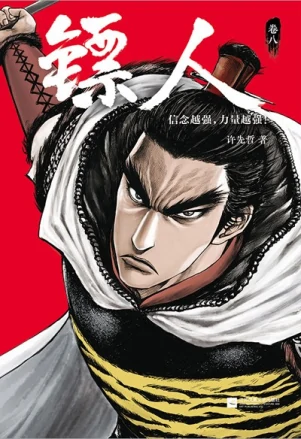
        <div class="layer">
          <h3>章回叁 江湖</h3>
        </div>
      </div>
    </div>
  </section>
```
.png)

#### 2.3 人物界面
该界面将介绍漫画主要角色，共六个，设计六个纵向矩形的人物卡片，用\<div>括住这六张卡片实现多列布局。
```html
<section id="characters">
    <h1>MAJOR CHARACTERS</h1>
    <p>“知世郎是点灯人，点灯人不需要武艺。”</p>
    <div class="row">
      <div class="col">
        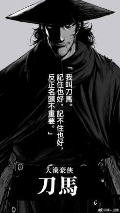
       
        <p>身份不明的神秘鏢客，曾是隋國驍騎衛中的一員。 武功高强，隨身攜帶大量武器，常戴斗笠，著披風裝扮，與孩子小七一起行走江湖。 性格豪放，心思縝密，非常疼愛小七。 表面上為利益驅使而行動，實則按照自己的道義和處世原則來行事。</p>
      </div>
      <div class="col">
        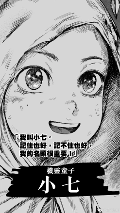
      
        <p>刀馬帶著的孩子，身份神秘，懂事可愛，刀馬騎在馬背上時就讓小七坐在自己懷裡，一起行走江湖。 小七與刀馬常規約定：在刀馬殺人時，小七自覺蒙上眼睛數數，數到約定的數位，小七就能睜開眼，同時刀馬也保證將敵人在此時間內全部擊倒。</p>
      </div>
      <div class="col">
        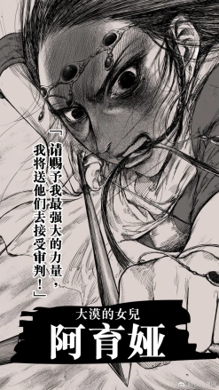
       
        <p>老莫的女兒，性格直爽，身手矯健。 喜歡刀馬，被刀馬與小七稱呼為“丫頭”。
        </p>
      </div>
      <div class="col">
        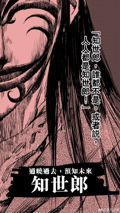
    
        <p>身著紅羅緞，臉上塗抹著詭異的紋路，平時說著一些不著邊際的話，認真起來卻仿佛通曉天下事。 其真實身份為花顏團魁首，曾領導了對隋朝的叛亂，之後被驍騎衛平定。
        是被隋國朝廷大為忌憚的通緝要犯，身患重症，為時不多，曾通過老莫的幫助前往天竺，之後被老莫委託給刀馬護送前往長安，欲求顛覆朝廷。</p>
      </div>
      <div class="col">
        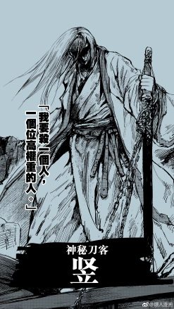
  
        <p>身手不凡的劍客，右臉有一道傷疤，綽號“玉面鬼”，出身大有來頭，所帶佩刀源於柱國大將軍。</p>
      </div>
      <div class="col">
        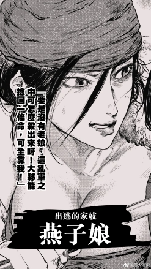
     
        <p>是大興城坊間勢力人物的侍婢，樣貌出眾的奇女子，風情萬種且心眼頗多。 學紅拂女的事蹟與小白臉私奔，之後被主家委託的豎所追捕拘押。 在途中遇到刀馬一行人，一路上總是想伺機脫逃。 在眾人被西域家族追殺之時，曾多次出手保護小七不受傷害。</p>
      </div>
    </div>
  </section>

```
.png)

#### 2.4 评价页面
该页面展示《镖人》漫画的网络评价，摘选了四条评论，形成2*2的布局，每条评论单元包括头像、昵称、评论、评分这四个元素。
```html
<section id="evaluation">
    <h1>EVALUATION</h1>
    <p style="color: #777;">“一個人憑藉自身的力量和意志，可以對抗數十人、上百人。但再强的人，都無力對抗時勢的洪流。除非，你來造一個時勢。”
      <br> ——第五十回 家園
    </p>
    <div class="row">
      <div class="col">
        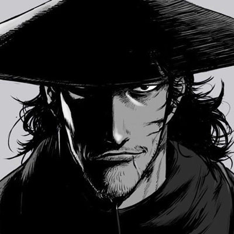
        <div>
          <p>
            首张漫画《镖人》的人设，好像井上雄彦的《浪客行》里的宫本武藏。感觉蛮不错的，国漫真的值得被期待。
          </p>
          <h3>刀馬我男神</h3>
          <i class="fa-solid fa-star"></i>
          <i class="fa-solid fa-star"></i>
          <i class="fa-solid fa-star"></i>
          <i class="fa-solid fa-star"></i>
          <i class="fa-regular fa-star"></i>
        </div>
      </div>
      <div class="col">
        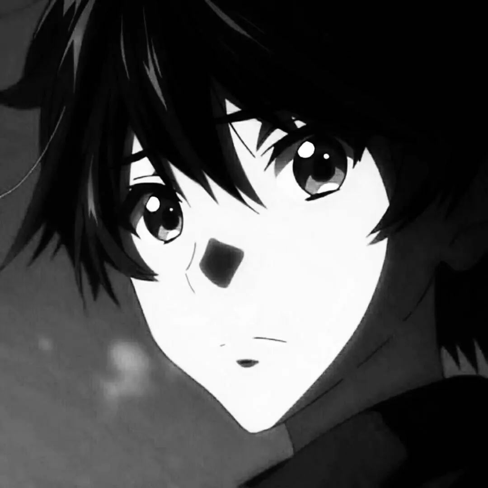
        <div>
          <p>
            许先哲的漫画《镖人》真不错。序章的风格有点《苍天航路》的影子，正篇却是《火凤燎原》的范儿。期待这部将来能出单行本，这样的国漫才值得花钱收藏。
          </p>
          <h3>ringo林檎</h3>
          <i class="fa-solid fa-star"></i>
          <i class="fa-solid fa-star"></i>
          <i class="fa-solid fa-star"></i>
          <i class="fa-solid fa-star"></i>
          <i class="fa-solid fa-star-half-stroke"></i>
        </div>
      </div>
      <div class="col">
        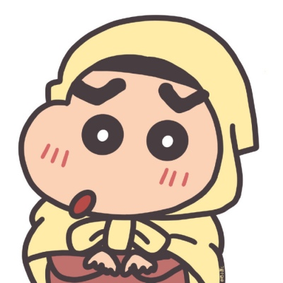
        <div>
          <p>
            《镖人》是一部让人震撼的作品，无论是画风还是剧情都非常成熟，让人看到了国漫的希望。作品对人物的刻画很立体，大背景的渲染也很到位，值得推荐给爱看漫画的各位。
          </p>
          <h3>小牛牛</h3>
          <i class="fa-solid fa-star"></i>
          <i class="fa-solid fa-star"></i>
          <i class="fa-solid fa-star"></i>
          <i class="fa-solid fa-star"></i>
          <i class="fa-regular fa-star"></i>
        </div>
      </div>
      <div class="col">
        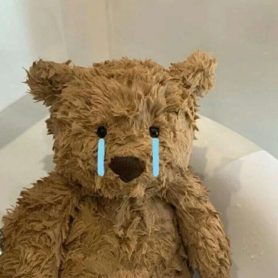
        <div>
          <p>
            看过之后，这部漫画给我的第一印象是：要在白天看，因为场面有点暴力血腥。当初我看火影里面伊那利的父亲惨状，以及海贼王里杰克对猫蝮蛇犬岚动刑的场面，都是硬着头皮看的。镖人这种刀枪入体斩首爆头的场面更有冲击力，胆小的朋友慎点。
          </p>
          <h3>大王個花</h3>
          <i class="fa-solid fa-star"></i>
          <i class="fa-solid fa-star"></i>
          <i class="fa-solid fa-star"></i>
          <i class="fa-solid fa-star"></i>
          <i class="fa-regular fa-star"></i>
        </div>
      </div>
    </div>
  </section>
```
.png)

#### 2.5 BACK
主页的结束页面，在该页面使用漫画插图增强主题颜色，并添加“BACK”按钮，可返回首页。
```html
<section id="back">
    <h1>⌈ 信念越強，力量越强！⌋</h1>
    <a href="" class="hero-btn">BACK</a>
  </section>
```
.png)


### 3. 其他设计
本网页多出元素具有平滑过渡的效果，如漫画页面使用css样式transition来实现，鼠标停留，文字平滑出现同时背景变暗的效果。css代码如下：
```css
#comic .row .col .layer {
  position: absolute;
  top: 0;
  left: 0;
  height: 100%;
  width: 100%;
  background: transparent;
  -webkit-transition: .5s;
  transition: .5s;
}

#comic .row .col .layer h3 {
  position: absolute;
  bottom: 0;
  opacity: 0;
  width: 100%;
  color: #fff;
  font-size: 1.5rem;
  -webkit-transition: .5s;
  transition: .5s;
}

#comic .row .col .layer:hover {
  background: rgba(2, 2, 2, 0.5);
}

#comic .row .col .layer:hover h3 {
  bottom: 50%;
  opacity: 1;
  font-size: 3.5rem;
}
```
.png)

## 三、遇到的问题
### 1.css样式效果不理想
在开发设计网页效果时，常常遇到查询到的css属性运用与目标要求不符的问题，只能通过搜索引擎查找多个网络资源，一一匹配目标要求，同时也在这过程中发现，有一个好的css框架模板十分的事半功倍。

## 四、总结
虽然早在前几个学期接触过一点前端开发，但往往是为了测试后端项目草草学习设计的。WEB这门课程让我对前端设计有了新的认知，兼顾美学与逻辑的设计过程也十分有意思，并且，它拥有及时反馈设计效果的特点，很容易产生成就感。Web的前半部分，介绍HTML、CSS、JavaScript，TypeScript的部分相对来说比较简单。比较遗憾的是没有尝试一下自己编写一个Angular动态网页。在网页设计过程中，由于缺乏训练，所以在设计时也遇到了很多麻烦，有时插入一个目标效果也是百经磨难。在网页制作过程中，想提高设计水平，想有个理想的网页，除了多模仿优秀网页设计，更需要不断的联系，这是一个持久的过程。
